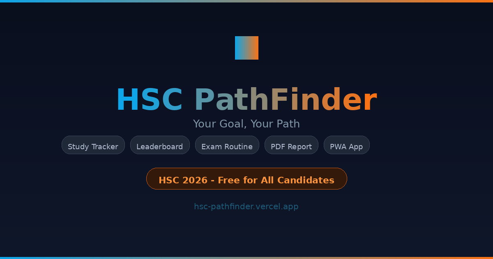

<div align="center">



# 🎓 HSC PathFinder
### তোমার লক্ষ্য, তোমার পথ — Your Goal, Your Path

[](https://hsc-pathfinder.vercel.app)
[](https://hsc-pathfinder.vercel.app)
[](LICENSE)
[](https://hsc-pathfinder.vercel.app)

**The ultimate free study tracker for HSC 2026 candidates in Bangladesh.**
Track study hours · Compete on leaderboard · Stay motivated · Ace your exams

[🚀 Open App](https://hsc-pathfinder.vercel.app) · [🐛 Report Bug](https://github.com/arnnikislam/hsc-pathfinder/issues) · [💡 Request Feature](https://github.com/arnnikislam/hsc-pathfinder/issues)

</div>

---

## ✨ Features

| Feature | Description |
|---|---|
| ⏳ **Live Countdown** | Real-time countdown to HSC exam start — 02 July 2026, 10:00 AM |
| 📊 **Study Tracker** | Log study hours & minutes with daily progress ring |
| 📈 **Study Analysis** | Visual bar chart — 7 days, 15 days, 1 month view |
| 💬 **Daily Motivation** | Rotating motivational quotes in Bangla & English |
| 🏆 **Leaderboard** | Today / Week / Month / All-time with Science/Arts/Commerce filter |
| 📅 **Exam Routine** | Official HSC 2026 routine for all 3 groups |
| 👤 **Custom Profile** | Upload & crop your own profile photo |
| 📄 **PDF Export** | Beautiful print-ready study report |
| 🔔 **3x Daily Reminders** | Push notifications + email at 2PM, 6PM, 10PM if goal not met |
| 📝 **Daily Commitment** | Daily honesty pledge modal — keeps data authentic |
| 🌐 **Bilingual** | Full Bangla & English support |
| 📱 **PWA** | Install on Android/iPhone like a native app |

---

## 📱 Screenshots

> Dashboard · Leaderboard · Study Graph · Exam Routine

---

## 🛠️ Tech Stack

| Layer | Technology |
|---|---|
| **Frontend** | React 18 + Vite |
| **Styling** | Tailwind CSS |
| **Auth** | Firebase Authentication (Google) |
| **Database** | Cloud Firestore |
| **Email** | EmailJS |
| **PDF** | jsPDF |
| **i18n** | react-i18next |
| **PWA** | vite-plugin-pwa |
| **Hosting** | Vercel |

---

## 🚀 Getting Started

### Prerequisites
- Node.js 18+
- Firebase project (free Spark plan)
- EmailJS account (free — 200 emails/month)

### 1. Clone
```bash
git clone https://github.com/arnnikislam/hsc-pathfinder.git
cd hsc-pathfinder
```

### 2. Install
```bash
npm install
```

### 3. Firebase Setup
1. Go to [console.firebase.google.com](https://console.firebase.google.com)
2. Create project → Enable **Google Authentication**
3. Create **Firestore Database** (production mode)
4. Paste `firestore.rules` into Firestore → Rules → Publish
5. Get your config from Project Settings → Web App
6. Update `src/firebase/config.js` with your keys

### 4. EmailJS Setup
1. Create account at [emailjs.com](https://emailjs.com)
2. Add Gmail service → get Service ID
3. Create email template → get Template ID
4. Copy Public Key
5. Update `src/utils/emailReminder.js` with your credentials

### 5. Run
```bash
npm run dev
```
Open [http://localhost:5173](http://localhost:5173)

---

## 📂 Project Structure

```
hsc-pathfinder/
├── public/
│   ├── logo.svg              # App logo
│   ├── og-image.png          # Social share preview
│   └── icons/                # PWA icons
├── src/
│   ├── components/
│   │   ├── BottomNav.jsx         # Mobile navigation
│   │   ├── CommitmentModal.jsx   # Daily honesty pledge
│   │   ├── CountdownBanner.jsx   # HSC exam countdown
│   │   ├── MotivationalQuote.jsx # Daily rotating quotes
│   │   ├── NotificationManager.jsx # Push + email reminders
│   │   ├── PhotoCropper.jsx      # Profile photo crop tool
│   │   ├── PWAInstallBanner.jsx  # PWA install prompt
│   │   └── StudyGraph.jsx        # Bar chart analysis
│   ├── contexts/
│   │   └── AuthContext.jsx       # Firebase auth state
│   ├── firebase/
│   │   └── config.js             # Firebase config
│   ├── i18n/
│   │   ├── en.json               # English translations
│   │   └── bn.json               # Bangla translations
│   ├── pages/
│   │   ├── Login.jsx
│   │   ├── Onboarding.jsx
│   │   ├── Dashboard.jsx         # Main page
│   │   ├── Leaderboard.jsx
│   │   ├── Routine.jsx
│   │   ├── Account.jsx
│   │   └── Developer.jsx
│   └── utils/
│       ├── emailReminder.js      # EmailJS integration
│       ├── pdfExport.js          # PDF report generator
│       ├── photoUpload.js        # Base64 photo storage
│       └── streakUtils.js        # Streak calculation
├── firestore.rules               # Firestore security rules
└── README.md
```

---

## 🔐 Firestore Security Rules

Paste `firestore.rules` in Firebase Console → Firestore → Rules:

```
rules_version = '2';
service cloud.firestore {
  match /databases/{database}/documents {
    match /users/{userId} {
      allow read:  if request.auth != null;
      allow write: if request.auth != null && request.auth.uid == userId;
    }
    match /studyLogs/{logId} {
      allow read:   if request.auth != null;
      allow create: if request.auth != null
                    && request.resource.data.userId == request.auth.uid;
      allow update, delete: if request.auth != null
                    && resource.data.userId == request.auth.uid;
    }
  }
}
```

---

## 📱 PWA Installation

**Android (Chrome):**
1. Open app in Chrome
2. Tap three-dot menu → "Add to Home Screen"
3. Tap Install ✅

**iPhone (Safari):**
1. Open app in Safari
2. Tap Share button → "Add to Home Screen"
3. Tap Add ✅

---

## 🌐 Deploy to Vercel

1. Push code to GitHub
2. Go to [vercel.com](https://vercel.com) → Import repo
3. Framework: **Vite** (auto-detected)
4. Click Deploy → live in 60 seconds ⚡

---

## 👨‍💻 Developer

<div align="center">

**Arnnik Islam Payel**
*Web Developer · Wi-Fi Pentester · Tech Content Creator · 🇧🇩 Bangladesh*

[](https://arnnikislam.vercel.app)
[](https://github.com/arnnikislam)
[](https://youtube.com/@arnnikislam)
[](https://linkedin.com/in/arnnikislam)

📧 arnnikislam.socials@gmail.com

</div>

---

## 📝 License

MIT License — free to use, fork and improve!

---

<div align="center">

**Built with ❤️ for HSC 2026 candidates of Bangladesh**

⭐ **Star this repo if it helps you study!**

*তোমার লক্ষ্য, তোমার পথ — Your Goal, Your Path*

</div>
